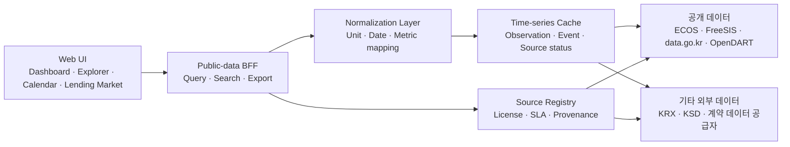
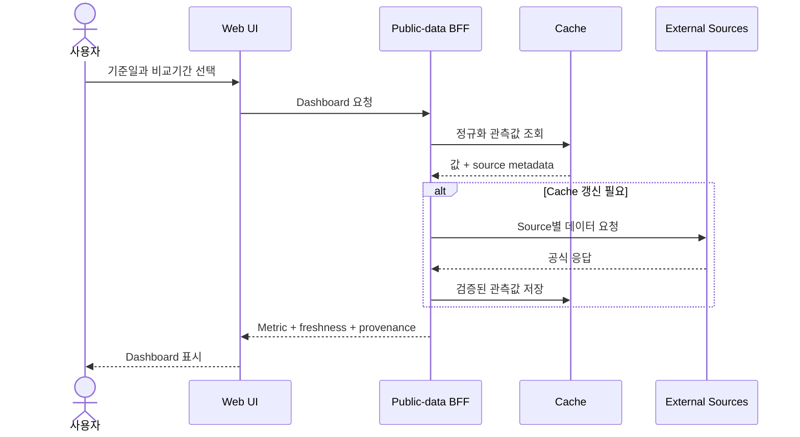
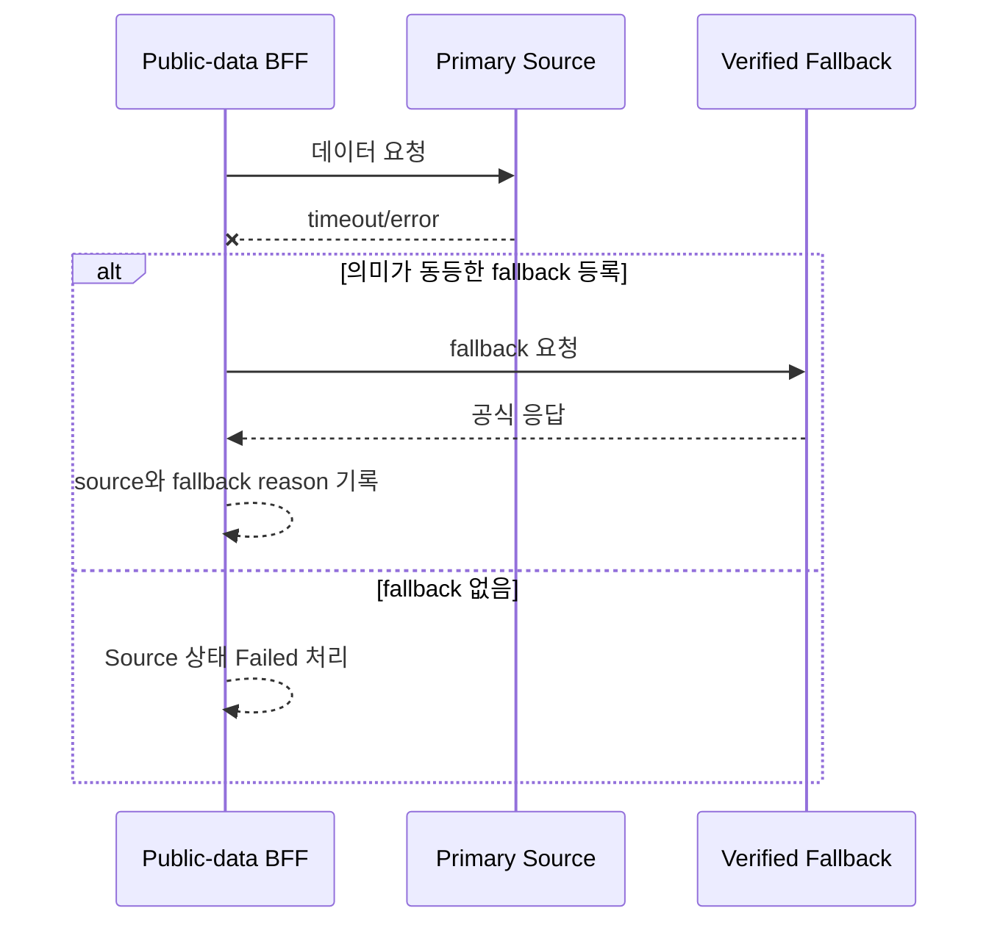

# Bond Operations External Intelligence Dashboard

> **Design Document · v1.0 Scope Reset**

투자자산 결산 · Settlement · 채권대여 업무를 위한 외부 시장정보 대시보드

| 항목 | 내용 |
|---|---|
| 문서 버전 | v1.0 Scope Reset |
| 작성 기준일 | 2026-08-12 |
| 문서 목적 | 외부 공개·계약 데이터만 사용하는 정보 대시보드의 범위와 구현 기준 정의 |
| 대상 독자 | 투자자산관리 담당자, 서비스 기획자, 개발·데이터 담당자 |

> **최상위 정책 제약:** 사내 시스템 연동과 사내 데이터 반입은 허용하지 않는다.
> 애플리케이션은 OMS/PMS, 회계, 수탁, 결제, 보유종목, 거래, 전표, 상대방,
> 내부 대차계약 및 기타 비공개 업무 데이터에 접근하거나 이를 입력·업로드·저장하지
> 않는다.

# 1. Executive Summary

본 시스템은 투자자산 결산, Settlement, 채권대여 업무 담당자가 매일 확인하는
금리, 환율, 채권시장, 결제 캘린더, 발행사 이벤트, 대차시장 동향 등의 외부 수치를
한 화면에서 조회·비교·탐색할 수 있게 하는 정보 대시보드다.

본 시스템은 내부 업무를 처리하는 운영시스템이 아니다. 특정 포트폴리오의 손익,
결제상태, 대사 결과 또는 대여 가능 잔고를 계산하지 않으며, 공식 회계수치나
투자판단을 대체하지 않는다. 모든 값은 출처, 기준일, 갱신시각, 단위 및 이용조건과
함께 참고정보로 제공한다.

## 1.1 Problem Statement

- 결산·세틀·채권대여 업무에 참고하는 외부 수치가 여러 기관과 사이트에 흩어져 있다.
- 동일 지표도 기준일, 단위, 발표시각 및 개정 여부가 달라 비교 과정에서 오류가
  발생하기 쉽다.
- 휴장일, 이자·상환 일정, 공시 및 신용 이벤트를 개별 사이트에서 반복 확인해야 한다.
- 대차잔고, 공매도, 채권 거래량과 금리 변화를 함께 비교하기 어렵다.
- 공개 데이터 API 장애나 지연 시 값의 출처와 최신성을 판단하기 어렵다.

## 1.2 목표

| ID | 목표 | 성공 기준 |
|---|---|---|
| G-01 | 정보 탐색 시간 단축 | 핵심 외부지표와 일정에 2 interaction 이내 접근 |
| G-02 | 출처 투명성 | 모든 표시 값에 source, as-of, retrieved-at, unit 제공 |
| G-03 | 변화 파악 | 전일·전주·전월말 대비 절대차와 증감률 제공 |
| G-04 | 이벤트 조기 인지 | 휴장, 상환, 이자, 공시, 등급변동을 날짜순으로 확인 |
| G-05 | 안전한 사용 | 내부 데이터 무수집 및 외부 데이터 라이선스 준수 |

## 1.3 In Scope / Out of Scope

| 구분 | 범위 |
|---|---|
| In Scope | 외부 금리·환율, 채권시장 통계, 시장자금, 결제 캘린더, 공개 Corporate Action, 발행사 공시·신용 이벤트, 대차·공매도 시장 통계, 검색, 비교, 출처 설명, Export |
| Out of Scope | 모든 사내 시스템 연동, 내부 파일·CSV 업로드, 보유종목·포트폴리오·거래·전표·결제상태·상대방·담보·대차계약 데이터, 내부 대사, 예외 workflow, 주문·회계·결제 처리, 투자 추천 |

## 1.4 데이터 사용 원칙

1. 공개 데이터 또는 정식 계약한 외부 데이터만 사용한다.
2. 출처와 이용조건을 확인하지 못한 데이터는 운영 화면에 노출하지 않는다.
3. 값을 추정하거나 임의 생성하지 않는다.
4. fallback은 동일 통계 원천 또는 의미가 동등하다고 검증된 transport에만 적용한다.
5. stale 값을 최신값처럼 표시하지 않는다.
6. 평가가격, 대차 fee 등 라이선스 데이터는 계약 범위 안에서만 표시·저장·Export한다.
7. 사용자가 사내 정보나 보유종목 목록을 입력할 수 있는 기능을 제공하지 않는다.

# 2. 사용자 및 UX 설계 원칙

| Persona | 주요 업무 | 핵심 니즈 |
|---|---|---|
| 투자자산 결산 담당자 | 기준금리·수익률·환율·시장가격 확인 | 기준일, 변화폭, 공식 출처 |
| Settlement 담당자 | 영업일·휴장일·상환·이자 일정 확인 | 날짜별 일정, 시장·통화 구분 |
| 채권대여 담당자 | 대차잔고·거래량·공매도·fee 동향 확인 | 시장 수준, 종목별 비교, 최신성 |
| 관리자 | 시장 변화와 주요 이벤트 요약 확인 | 중요 변화, 데이터 상태, Export |

## 2.1 UX 원칙

| ID | 원칙 | 설명 |
|---|---|---|
| UX-01 | Source-first | 수치와 함께 출처·기준일·단위·갱신시각을 표시한다. |
| UX-02 | Compare-first | 현재값과 전일·전주·전월말 값을 함께 제공한다. |
| UX-03 | External-only | 포트폴리오·보유·거래 등 내부 컨텍스트를 요구하지 않는다. |
| UX-04 | Progressive detail | 시장 요약에서 지표 시계열, 종목, 공시 원문으로 이동한다. |
| UX-05 | Freshness visible | Fresh, Delayed, Stale, Failed 상태를 색상과 텍스트로 표시한다. |
| UX-06 | No false precision | 원천 단위와 공표 정밀도를 유지하고 과도한 환산을 피한다. |
| UX-07 | Accessible | 키보드 탐색, 명확한 focus, 색상 외 상태표현을 제공한다. |

# 3. 시스템 개요 및 논리 아키텍처

애플리케이션 서버는 등록된 외부 Source adapter를 통해 데이터를 수집하고,
source별 원본 메타데이터를 보존한 뒤 canonical metric과 event로 정규화한다.
브라우저는 서버 API만 호출하며 외부 API key를 전달받지 않는다.



**금지 경로:** 내부망, 사내 API, 내부 DB, 사용자 파일 업로드 및 내부 데이터
복사 경로는 아키텍처에 포함하지 않는다.

## 3.1 데이터 도메인

| 도메인 | 대표 데이터 |
|---|---|
| Rates | 기준금리, 국고채·통안채·회사채 수익률, 수익률곡선, 신용 스프레드 |
| FX | 주요 원화 환율, 고시시각, 기준환율 종류 |
| Market Funds | 투자자예탁금, RP 잔고, 미수금, 반대매매 |
| Bond Market | 발행·상환·잔액, 장내외 거래량, 평균수익률 |
| Calendar | 시장 휴장일, 통화별 결제 영업일, 공휴일 |
| Security Events | 이자지급, 만기상환, 조기상환, 권리행사, 공시 |
| Lending Market | 대차 체결·상환·잔고, 공매도 거래·잔고, 공개 fee benchmark |
| Issuer/Credit | 발행사 공시, 신용등급 및 등급전망 변경 |
| Metadata | source, as-of, effective time, retrieved-at, unit, license, freshness |

## 3.2 Source 후보와 도입 정책

| Source | 주요 용도 | 인증/계약 | 도입 상태 |
|---|---|---|---|
| 금융투자협회 FreeSIS | 시장자금 및 채권시장 통계 | 현재 확인된 조회는 key 없음 | 사용 중 |
| 금융위원회 공공데이터포털 | KOFIA 통계의 공식 transport fallback | 일반 인증키 | 일부 사용 중 |
| 한국은행 ECOS | 기준금리, 금리, 환율, 거시지표 | API 인증키 | 도입 후보 |
| OpenDART | 발행사 공시와 주요 이벤트 | API 인증키 | 도입 후보 |
| KRX Open API/Data Marketplace | 시장 일정, 채권·공매도 통계 | 인증 및 데이터별 이용조건 | 검증 필요 |
| KSD SEIBro/데이터 서비스 | 종목정보, 상환·이자·대차 관련 공개정보 | 공개 범위 또는 별도 계약 | 검증 필요 |
| KIS/NICE P&I/FnPricing 등 | 평가가격, 수익률, 스프레드, fee | 유료 계약 | 선택 범위 |

Source 등록 전 데이터 항목, 단위, 발표주기, 개정정책, 이용조건, 재배포 가능
범위를 확인한다. 사이트 화면의 비공개·비문서 API를 사용할 경우 이용조건과
변경 위험을 별도로 승인받는다.

# 4. 기능적 요구사항

우선순위는 Must / Should / Could로 구분한다.

| ID | 영역 | 요구사항 | 우선순위 |
|---|---|---|---|
| FR-001 | Dashboard | 기준금리, 주요 채권금리, 환율, 시장자금, 채권거래 핵심지표 표시 | Must |
| FR-002 | Dashboard | 전일·전주·전월말 대비 절대차와 증감률 표시 | Must |
| FR-003 | Dashboard | 중요 금리·환율 변화와 예정 이벤트 요약 표시 | Must |
| FR-004 | Rates Explorer | 기간, 지표, 만기, 등급을 선택해 시계열과 수익률곡선 비교 | Must |
| FR-005 | Rates Explorer | 국고채 대비 회사채 스프레드와 기간별 변화 표시 | Should |
| FR-006 | Bond Market | 발행·상환·잔액·거래량을 기간 및 채권유형별 조회 | Must |
| FR-007 | Settlement Calendar | 국내외 시장·통화별 휴장일과 결제 영업일 표시 | Must |
| FR-008 | Security Events | 공개된 이자·상환·조기상환·Corporate Action 일정 조회 | Must |
| FR-009 | Disclosures | 발행사 공시와 신용등급·등급전망 변경 조회 | Should |
| FR-010 | Lending Market | 공개 대차 체결·상환·잔고 추이 표시 | Must |
| FR-011 | Lending Market | 공매도 거래량·잔고와 대차지표를 함께 비교 | Should |
| FR-012 | Lending Market | 계약된 경우 종목별 외부 fee benchmark 표시 | Could |
| FR-013 | Search | 종목명, ISIN, 발행사 및 외부 공시 통합검색 | Must |
| FR-014 | Explain | 지표의 정의, 단위, source, as-of, retrieved-at 표시 | Must |
| FR-015 | Explain | 원천 페이지 또는 공식 문서 링크 제공 | Must |
| FR-016 | Data Status | Source별 Fresh/Delayed/Stale/Failed 상태 표시 | Must |
| FR-017 | Export | 현재 표와 차트를 CSV 또는 이미지로 내보내기 | Should |
| FR-018 | Alert | 외부 이벤트·지표 임계치의 브라우저 알림 | Could |
| FR-019 | Source Admin | 비밀값 노출 없이 Source 상태·라이선스·갱신주기 조회 | Should |
| FR-020 | Privacy Guard | 내부 데이터 입력·업로드·연동 기능을 제공하지 않음 | Must |

## 4.1 핵심 Metric 예시

| Metric | 정의 | 단위 | 갱신 |
|---|---|---|---|
| Bank of Korea Base Rate | 한국은행이 공표한 기준금리 | % | 발표 시 |
| Government Bond Yield | 지정 만기의 국고채 대표수익률 | % | 일 |
| Credit Spread | 동일 기준의 회사채 수익률 - 국고채 수익률 | bp | 일 |
| KRW Exchange Rate | Source가 정의한 원화 환율 | 통화쌍 | 일/Intraday |
| Investor Deposits | 금융투자협회 공표 투자자예탁금 | KRW | 일 |
| Bond Trading Volume | Source가 공표한 채권 거래량 | KRW/건 | 일 |
| Lending Balance | 외부 Source가 공표한 대차잔고 | 수량/KRW | 일 |
| Short-selling Balance | 외부 Source가 공표한 공매도 잔고 | 수량/KRW/% | 일 |
| Upcoming Redemption | 공개 종목정보 기준 예정 상환 이벤트 | 건/KRW | 일 |

서로 다른 Source의 이름이 유사하더라도 정의, 표본, 기준시각 또는 단위가 다르면
같은 Metric으로 합치지 않는다.

# 5. 비기능적 요구사항

| ID | 분류 | 요구사항 | 검증 |
|---|---|---|---|
| NFR-001 | 성능 | Dashboard 최초 로드 P95 3초 이내 | 캐시 포함 부하 테스트 |
| NFR-002 | 신선도 | source SLA를 기준으로 지연·stale 상태 계산 | 시간 경계 테스트 |
| NFR-003 | 정합성 | 표시값이 원천 응답과 정의된 변환 후 일치 | fixture/contract test |
| NFR-004 | 출처성 | 표시 Metric 100%에 source·as-of·unit 제공 | coverage test |
| NFR-005 | 가용성 | 개별 Source 장애가 다른 화면을 성공으로 위장하지 않음 | 부분 실패 테스트 |
| NFR-006 | 비밀관리 | API key는 서버 측 Secret으로만 관리 | 노출 검사 |
| NFR-007 | 개인정보 | 사용자 및 내부 업무 데이터를 수집하지 않음 | 입력·로그 점검 |
| NFR-008 | 라이선스 | 저장·표시·Export가 공급자 이용조건을 준수 | source별 승인 |
| NFR-009 | 접근성 | 키보드, focus, 색상 외 상태표현, 대비 제공 | WCAG 2.1 AA 점검 |
| NFR-010 | 브라우저 | Chromium 최신 2개 버전 지원 | 회귀 테스트 |
| NFR-011 | 관측성 | source latency, error, data lag, cache age 수집 | 운영 대시보드 |
| NFR-012 | 확장성 | Source adapter와 Metric mapping으로 공급자 추가 | adapter contract test |
| NFR-013 | 보존 | 원천 이용조건에 맞는 캐시 TTL과 삭제정책 적용 | 정책 테스트 |
| NFR-014 | 보안 | URL allowlist, timeout, response size/schema 검증 | 보안 테스트 |
| NFR-015 | 추적성 | FR/NFR과 테스트·Source를 연결 | 추적성 매트릭스 |

## 5.1 Key 및 Secret 정책

- 필요한 후보는 `DATA_GO_KR_SERVICE_KEY`, ECOS API key, OpenDART API key,
  KRX/KSD 또는 계약 공급자 credential이다.
- 모든 key는 서버 환경변수 또는 Secret Manager에서 주입한다.
- 브라우저 응답, URL, 로그, Export 및 오류 메시지에 key를 포함하지 않는다.
- Source credential이 없으면 해당 기능을 명시적으로 비활성화하며 값을 대체 생성하지
  않는다.
- credential 권한은 읽기 전용과 필요한 데이터 범위로 제한한다.

# 6. 주요 Use Case

| ID | 이름 | 기본 흐름 | 결과 |
|---|---|---|---|
| UC-01 | 아침 시장현황 확인 | Dashboard에서 금리·환율·시장자금·일정 확인 | 주요 변화 파악 |
| UC-02 | 결산 참고금리 확인 | 만기·등급 선택 → 시계열·곡선 비교 → 원천 확인 | 외부 기준값 확보 |
| UC-03 | 결제 일정 확인 | 시장·통화·기간 선택 → 휴장·결제 영업일 확인 | 일정 리스크 인지 |
| UC-04 | 상환·공시 확인 | 기간·발행사 검색 → 이벤트 → 원문 이동 | 공개 이벤트 확인 |
| UC-05 | 대차시장 확인 | 대차잔고·체결·공매도 추이 비교 | 시장 수급 파악 |
| UC-06 | 수치 근거 확인 | 지표 Explain → 정의·단위·source·as-of 확인 | 수치 신뢰성 판단 |
| UC-07 | 참고자료 Export | 현재 필터와 출처 메타데이터를 포함해 Export | 재현 가능한 참고자료 |

# 7. 대표 Sequence

## 7.1 Dashboard 조회



## 7.2 Source 장애와 fallback



# 8. 화면 구성

| 화면 | 핵심 구성요소 | 답해야 하는 질문 |
|---|---|---|
| S-01 External Morning Dashboard | 금리·환율·시장자금 KPI, 변화, 이벤트 | 오늘 달라진 외부 수치는 무엇인가? |
| S-02 Rates & Spread Explorer | 시계열, 수익률곡선, spread table | 금리와 spread가 어떻게 변했는가? |
| S-03 Settlement Calendar | 휴장일, 결제 영업일, 통화·시장 필터 | 어느 날짜에 결제 일정 주의가 필요한가? |
| S-04 Security Events | 이자·상환·조기상환·공시 목록 | 예정된 공개 이벤트는 무엇인가? |
| S-05 Lending Market | 대차 체결·상환·잔고, 공매도 통계 | 대차시장 수급이 어떻게 변했는가? |
| S-06 Source & Methodology | 정의, 단위, 갱신, 이용조건, 장애상태 | 이 수치를 어디까지 신뢰하고 이용할 수 있는가? |

## 8.1 공통 Context

- As-of Date
- Compare: Previous day / Previous week / Month-end
- Market: Korea / 지원 해외시장
- Currency
- Source

Portfolio, account, owner, counterparty 및 내부 상태 필드는 제공하지 않는다.

# 9. 데이터 처리 원칙

## 9.1 시간과 Snapshot

- Observation Date, Effective Time, Published Time, Retrieved-at을 구분한다.
- 일별 데이터와 Intraday 데이터를 같은 최신성 규칙으로 비교하지 않는다.
- 공휴일이나 미발표일은 이전값을 새 관측값으로 복제하지 않는다.
- 원천 개정이 있는 통계는 revision 여부와 이전값 변경을 기록한다.
- 모든 시간은 source timezone을 보존하고 UI에서 KST 변환 여부를 표시한다.

## 9.2 단위와 계산

- 원천 단위와 `monetaryScale`을 Source Registry에 등록한다.
- 비율 `%`, 연율 소수, `bp`를 명시적으로 구분한다.
- 환율은 통화쌍과 quote convention을 함께 보관한다.
- 스프레드는 동일 기준일과 호환 가능한 만기의 검증된 조합에서만 계산한다.
- 반올림은 표시 단계에서만 수행하고 계산에는 정규화 원값을 사용한다.

## 9.3 Source 상태

| 상태 | 정의 |
|---|---|
| Fresh | source SLA 내 최신 관측값 |
| Delayed | 예상 발표시각을 지났지만 허용 지연 범위 안 |
| Stale | 허용 지연 범위를 초과한 마지막 관측값 |
| Partial | 요청한 지표 중 일부만 검증 완료 |
| Failed | source 요청 또는 schema 검증 실패 |
| Unlicensed | credential 또는 이용권한 없음 |

# 10. API 초안

| Endpoint | 목적 | 주요 파라미터 |
|---|---|---|
| `GET /api/dashboard` | 외부 핵심지표와 이벤트 요약 | asOf, compare, market |
| `GET /api/rates` | 금리·수익률곡선·spread | series, tenor, rating, from, to |
| `GET /api/bond-market` | 발행·상환·잔액·거래량 | type, from, to |
| `GET /api/calendar` | 휴장·결제 영업일 | market, currency, from, to |
| `GET /api/security-events` | 이자·상환·공시 이벤트 | query, eventType, from, to |
| `GET /api/lending-market` | 대차·공매도 시장통계 | securityId, metric, from, to |
| `GET /api/search` | 종목·ISIN·발행사·공시 검색 | q, type, cursor |
| `GET /api/metrics/{id}/explain` | 지표 정의와 provenance | asOf, source |
| `GET /api/sources/status` | source별 상태와 최신성 | sourceId |

모든 응답은 가능한 경우 다음 메타데이터를 포함한다.

```json
{
  "sourceId": "registered-source-id",
  "asOf": "2026-08-11",
  "publishedAt": "2026-08-12T08:00:00+09:00",
  "retrievedAt": "2026-08-12T08:05:00+09:00",
  "unit": "KRW million",
  "status": "Fresh",
  "referenceUrl": "https://official.example/data"
}
```

# 11. 오류 및 표시 정책

- Source 실패를 빈 배열이나 0으로 변환하지 않는다.
- 일부 Source만 성공한 경우 화면 전체를 Fresh로 표시하지 않는다.
- fallback 사용 시 primary 실패 사유와 실제 provider를 표시한다.
- 계약되지 않은 데이터는 `Unlicensed`로 표시하고 유사값으로 대체하지 않는다.
- 원천 페이지 링크가 변경되면 Source 상태를 점검 대상으로 표시한다.
- 수치 하단에 “외부 참고정보이며 공식 회계·결제 결과가 아님”을 표시한다.

# 12. 테스트 및 수용 기준

| ID | 검증 영역 | 수용 기준 |
|---|---|---|
| AC-01 | External-only | 내부 endpoint, 내부 파일 업로드, 포트폴리오 입력 경로가 없음 |
| AC-02 | Source 정합성 | fixture 원천값과 정규화 결과가 단위 변환 후 일치 |
| AC-03 | Compare | 비교일 변경 시 연결된 지표가 동일 기준으로 갱신 |
| AC-04 | Provenance | 표시 Metric 100%에 source·as-of·unit·retrieved-at 존재 |
| AC-05 | Freshness | Fresh/Delayed/Stale/Partial/Failed 경계가 SLA대로 동작 |
| AC-06 | Failure | Source 장애 시 0·가상값·무표시 성공 상태를 만들지 않음 |
| AC-07 | Secret | API key가 브라우저·응답·로그·Export에 노출되지 않음 |
| AC-08 | License | source별 저장·표시·Export 범위가 승인된 이용조건과 일치 |
| AC-09 | Accessibility | 핵심 화면을 키보드만으로 탐색 가능 |
| AC-10 | Performance | Dashboard P95 3초 이내 |

# 13. 구현 단계

| 단계 | 범위 | 완료 조건 |
|---|---|---|
| Phase 0 — Source Approval | source 목록, 이용조건, key, 단위, SLA 확정 | Source Registry 승인 |
| Phase 1 — Public Foundation | FreeSIS/FSC, ECOS, 공통 adapter·cache·provenance | FR-001~004, FR-014~016 |
| Phase 2 — Calendar & Events | KRX/KSD 검증, OpenDART, 검색·캘린더 | FR-006~009, FR-013 |
| Phase 3 — Lending Market | 공개 대차·공매도 통계 | FR-010~011 |
| Phase 4 — Licensed Data | 평가가격·fee 등 계약 데이터 | 라이선스와 재배포 검증 |

각 Phase는 AC-01을 반복 검증하여 내부 데이터 경로가 추가되지 않도록 한다.

# 14. 주요 리스크 및 미결정 사항

| 리스크 | 설명 | 대응 |
|---|---|---|
| 비문서 API 변경 | FreeSIS 등 UI 기반 endpoint가 변경될 수 있음 | contract monitor와 명시적 실패 |
| 통계 정의 차이 | 유사 지표의 표본·시각·단위가 다를 수 있음 | Source별 Metric ID 분리 |
| 발표 지연 | 휴일·개정·기관 사정으로 관측값이 늦을 수 있음 | SLA 기반 freshness |
| 라이선스 | 평가가격·fee의 저장·재배포가 제한될 수 있음 | 계약 검토 후 feature flag |
| 일정 완전성 | 공개 Corporate Action이 모든 채권을 포괄하지 않을 수 있음 | coverage와 한계 표시 |
| 수치 오인 | 참고값이 공식 결산·결제 값으로 오인될 수 있음 | 지속적 disclaimer와 provenance |
| 외부 장애 | 여러 기관의 API 가용성에 의존 | 독립 source 상태와 제한적 fallback |

# 15. 요구사항 추적성

| Requirement | Use Case | Acceptance | Module |
|---|---|---|---|
| FR-001~003 | UC-01 | AC-03, AC-04, AC-10 | Dashboard |
| FR-004~006 | UC-02 | AC-02, AC-03 | Rates/Bond Market |
| FR-007~009 | UC-03, UC-04 | AC-02, AC-04 | Calendar/Events |
| FR-010~012 | UC-05 | AC-02, AC-08 | Lending Market |
| FR-013 | UC-04 | 검색 정확도·접근성 테스트 | Search |
| FR-014~016 | UC-06 | AC-04~AC-06 | Source/Explain |
| FR-017~019 | UC-07 | AC-07, AC-08 | Platform |
| FR-020 | 전체 | AC-01 | Privacy Guard |
| NFR-001~015 | 전체 | AC-01~AC-10 | Platform/Data |

## 다음 설계 단계

1. ECOS, OpenDART, KRX, KSD의 실제 제공 항목과 이용조건을 공식 문서로 확인한다.
2. 각 Source의 API key 발급 주체와 운영 Secret 보관 방식을 정한다.
3. 결산·세틀·대여 담당자가 매일 확인하는 외부지표 상위 20개를 확정한다.
4. 무료 공개 데이터만으로 가능한 MVP와 유료 계약 필요 기능을 분리한다.
5. 화면 와이어프레임으로 “한눈에 확인” 가능한 정보밀도를 검증한다.
