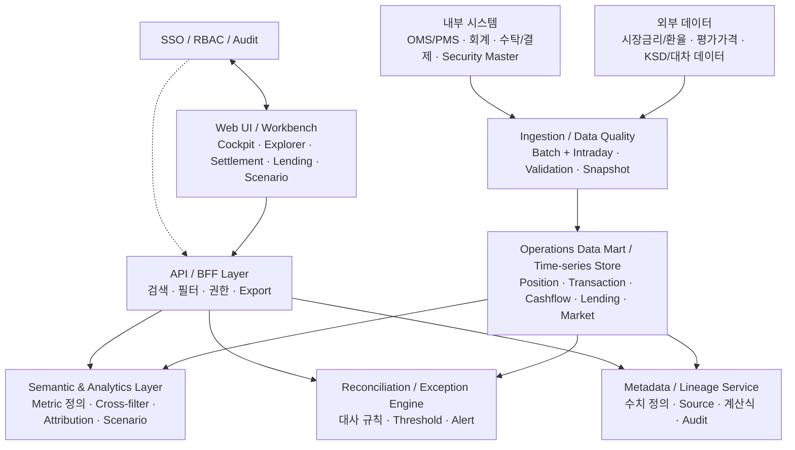
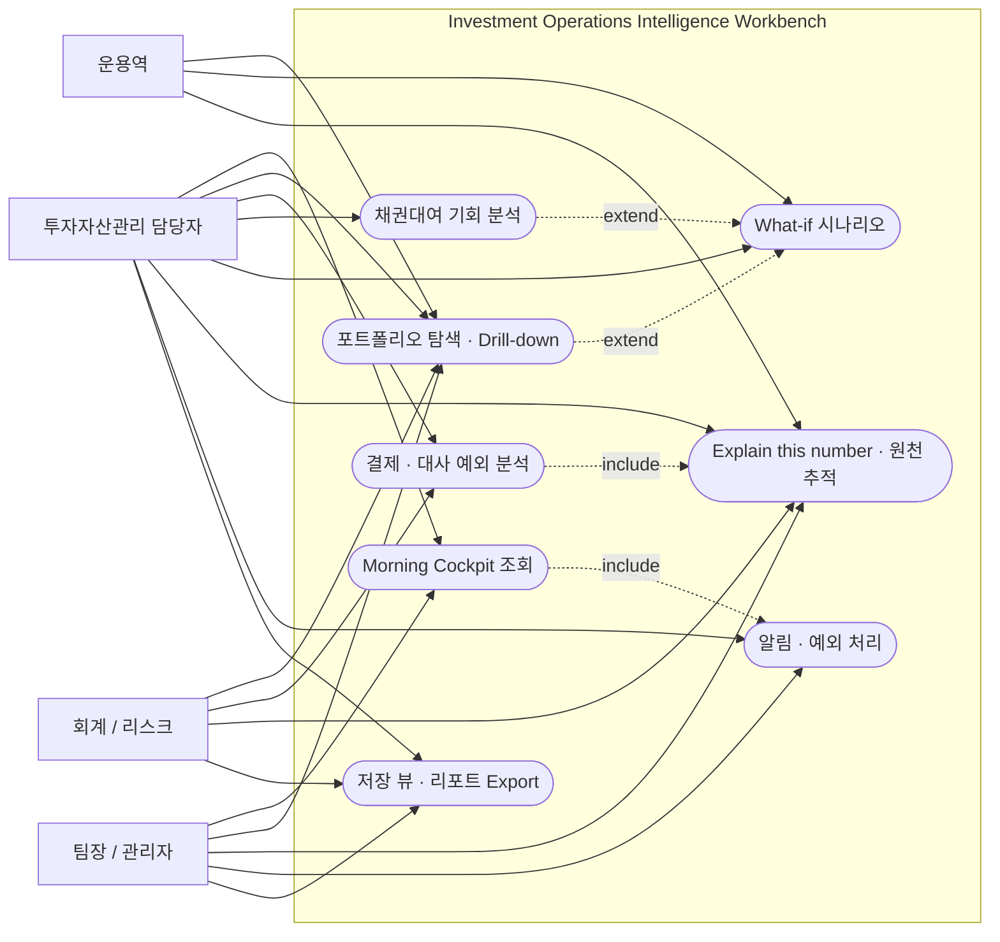
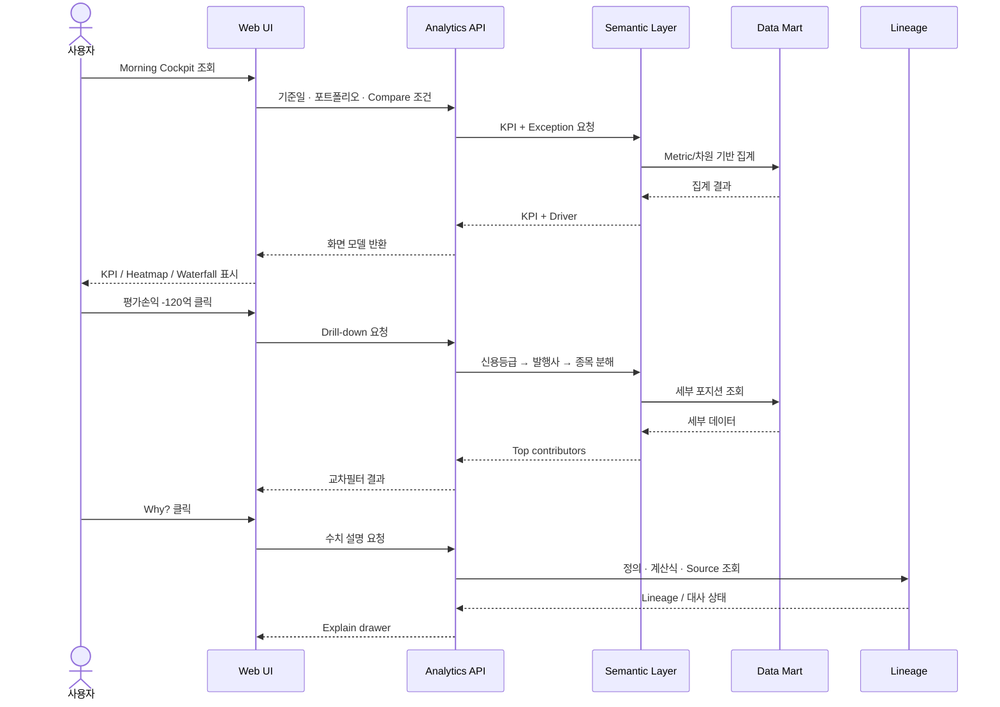
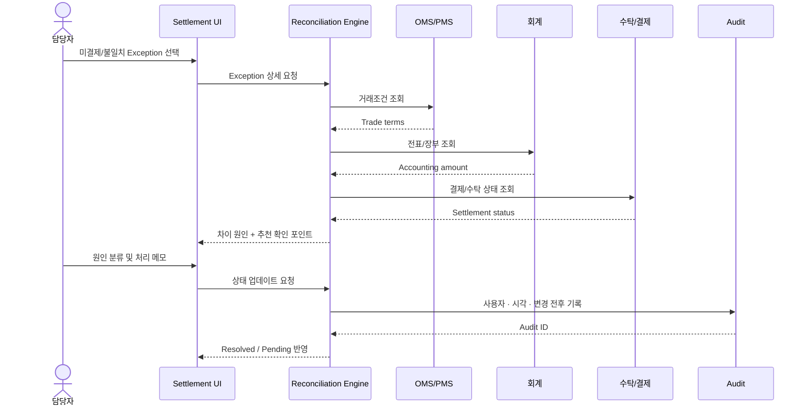
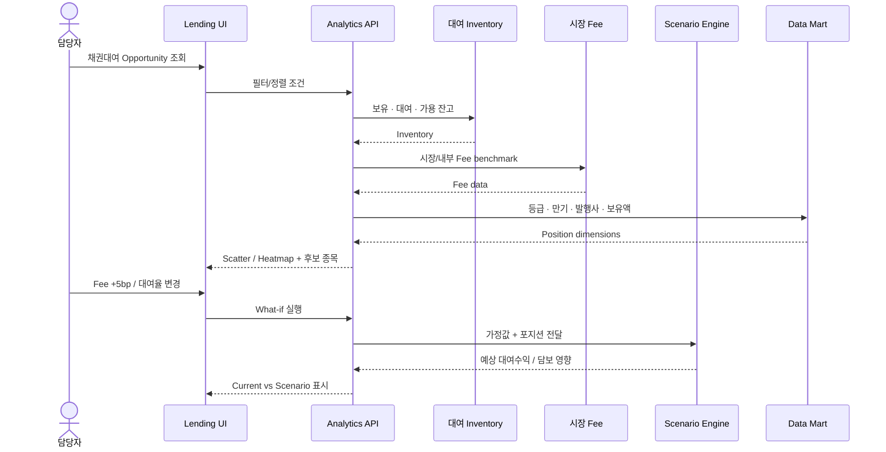

# Investment Operations Intelligence Workbench

> **Design Document · v0.9 Concept Design**

투자자산 결산 · Settlement · 채권대여 분석 및 운영 지원 플랫폼

| **문서 버전**   | v0.9 Concept Design                                      |
|-----------------|----------------------------------------------------------|
| **작성 기준일** | 2026-08-11                                               |
| **문서 목적**   | 요구사항 정의 및 UX/시스템 설계 초안                     |
| **대상 독자**   | 투자자산관리 · IT/데이터 · 회계/리스크 · 프로젝트 담당자 |

※ 본 문서는 특정 회사의 실제 내부 시스템 구조를 전제로 하지 않은 업무 컨셉 설계안입니다.

> **Codex 구현 기준:** 이 문서는 To-Be 요구사항 문서다. `Must` 요구사항을 우선 구현하고, `Should`/`Could`는 구현 범위를 명시적으로 선택한다. 문서에 없는 기능을 임의로 추가하거나, `Must` 기능을 단순 placeholder로 대체하지 않는다.

# 1. Executive Summary

본 시스템은 투자자산관리 담당자가 결산, 거래 결제(Settlement), 대사(Reconciliation), 채권대여 업무에서 필요한 수치와 예외사항을 한 곳에서 조회하고, 수치를 직접 비교·분해·교차필터링·시뮬레이션하여 원인을 빠르게 찾을 수 있도록 지원하는 분석형 운영 플랫폼이다.

| **핵심 설계 원칙** “Dashboard of numbers”가 아니라 “Workbench for decisions”로 설계한다. 사용자는 결과 수치에서 출발해 원인 → 종목/거래 → 원천 시스템까지 연속적으로 drill-through할 수 있어야 한다. |
|------------------------------------------------------------------------------------------------------------------------------------------------------------------------------------------------------|

## 1.1 Problem Statement

- 결산·세틀·채권대여 정보가 여러 시스템, 엑셀, 외부 데이터 소스에 흩어져 있어 동일 숫자를 재확인하는 시간이 크다.

- 현재값만 보여주는 대시보드는 “왜 변했는지”를 설명하지 못해 원인 분석을 다시 수작업으로 수행하게 된다.

- 장부·운용·수탁 데이터 간 차이를 발견하더라도 거래 단위 원천까지 이동하는 흐름이 단절되어 있다.

- 채권대여는 보유잔고, 대여가능잔고, 수수료율, 담보, 만기 및 시장 수준을 동시에 봐야 하나 비교·시뮬레이션 도구가 부족하다.

- 월말/분기말에는 대량의 예외와 마감 작업이 집중되므로 중요도 기반 큐와 감사 추적성이 필요하다.

## 1.2 목표

| **ID** | **목표**            | **성공 기준**                                                            |
|--------|---------------------|--------------------------------------------------------------------------|
| G-01   | 업무 탐색 시간 단축 | 핵심 KPI에서 원천 거래까지 3~4단계 내 도달                               |
| G-02   | 예외 조기 탐지      | 결제·대사·담보 부족 등을 임계치 기반으로 자동 식별                       |
| G-03   | 수치 설명 가능성    | 모든 주요 KPI에 정의·계산식·데이터 출처·갱신시각 제공                    |
| G-04   | 분석 자율성         | 차원 변경, Compare, Heatmap/Scatter, Pivot, What-if를 사용자가 직접 수행 |
| G-05   | 통제·감사 강화      | 사용자 액션, 수치 변경, 예외 상태 변경을 추적 가능하게 기록              |

## 1.3 In Scope / Out of Scope

| **구분**     | **포함**                                                                                                                                              | **비고**                                          |
|--------------|-------------------------------------------------------------------------------------------------------------------------------------------------------|---------------------------------------------------|
| In Scope     | Morning Cockpit, Portfolio Explorer, Settlement/Reconciliation, Securities Lending, Scenario Lab, Explain/Lineage, Alert/Exception, Saved View/Export | 분석 및 운영 의사결정 지원                        |
| Out of Scope | 주문 체결(OMS 대체), 회계전표 원장 시스템 대체, 실제 외부 대차계약 체결, 시장가격 산출기관 기능                                                       | 외부/기존 시스템과 연계하되 원장 역할은 하지 않음 |

# 2. 사용자 및 UX 설계 원칙

| **Persona**         | **주요 업무**                                  | **핵심 니즈**                             |
|---------------------|------------------------------------------------|-------------------------------------------|
| 투자자산관리 담당자 | 일일 결제, 미결제, 결산, 대사, 채권대여 운영   | 예외 우선순위, 신속한 원인추적, 근거 확인 |
| 팀장 / 관리자       | 마감 상태, 리스크·예외 현황, 운영 KPI 모니터링 | 전체 상태 요약, 심각도, 책임자, 처리기한  |
| 운용역              | 포트폴리오 손익·노출·현금흐름 확인             | 성과/변동 원인, 종목 기여도, 시나리오     |
| 회계 / 리스크       | 장부 정합성, 평가·손익·리스크 검증             | 계산식, 기준일, 데이터 출처, 대사 차이    |
| 시스템 관리자       | 권한, 데이터 품질, 운영 설정                   | RBAC, 규칙/임계치, 감사로그, 데이터 상태  |

## 2.1 UX 원칙

| **ID** | **원칙**               | **설명**                                                                                           |
|--------|------------------------|----------------------------------------------------------------------------------------------------|
| UX-01  | Cross-filter           | 차트·셀·KPI를 클릭하면 같은 컨텍스트의 다른 시각화와 상세 테이블이 동시에 필터링된다.              |
| UX-02  | Compare-first          | 현재 vs 전일/전월말/전년말/Benchmark/장부-vs-수탁/예상-vs-실제를 모든 핵심 화면에서 즉시 전환한다. |
| UX-03  | Progressive Drill-down | 전체 → 자산군 → 등급/만기 → 발행사 → 종목 → 거래/전표 순으로 단계적 상세화를 제공한다.             |
| UX-04  | Explain this number    | 모든 주요 수치에서 정의, 산식, 원천, 갱신시각, 시스템별 값, 차이를 한 번에 확인한다.               |
| UX-05  | Exception-first        | 업무 화면은 정상 건보다 처리 필요한 예외·마감 임박·금액 영향이 큰 건을 우선 노출한다.              |
| UX-06  | Reversible exploration | 필터/분해/시나리오 변경은 언제든 초기화/Undo 가능하며 원장 데이터에는 영향을 주지 않는다.          |
| UX-07  | Dense but scannable    | 기관 업무 특성상 정보밀도는 높이되 상태, 단위, 기준일, 중요도 표현은 일관되게 유지한다.            |

# 3. 시스템 개요 및 논리 아키텍처

시스템은 내부 원장/운용/수탁 데이터와 외부 시장 데이터를 수집하여 운영 데이터마트에 시계열 Snapshot으로 저장하고, Semantic Layer에서 공통 Metric을 계산한다. Reconciliation Engine은 시스템 간 차이를 규칙 기반으로 탐지하며, Lineage Service는 수치의 계산 및 원천을 설명한다.

**Figure 1. Logical Architecture**

## 3.1 주요 데이터 도메인

| **도메인**  | **대표 데이터**                                                                     |
|-------------|-------------------------------------------------------------------------------------|
| Position    | 기준일, 포트폴리오, 종목, 액면, 장부가, 평가액, 미수이자, 듀레이션, YTM, 등급, 만기 |
| Transaction | 거래일/결제일, 매수매도, 가격, 경과이자, 결제금액, 상대방, 상태                     |
| Accounting  | 계정, 장부금액, 이자수익, 상각, 평가손익, 처분손익, FX손익, 전표 ID                 |
| Settlement  | 예상/실제 결제금액, 결제상태, fail reason, cash/security movement                   |
| Lending     | 대여잔고, 가용잔고, fee, 담보가치, haircut, 상환예정, 상대방 exposure               |
| Market      | 금리곡선, 환율, 평가가격, credit spread, 대차 fee benchmark                         |
| Metadata    | Metric 정의, 단위, 산식, source table/field, 갱신주기, 데이터 owner                 |

# 4. 기능적 요구사항 (Functional Requirements)

우선순위는 Must / Should / Could로 구분한다. Must는 MVP 운영에 필수, Should는 1차 고도화, Could는 분석 편의 확장 기능이다.

| **ID** | **영역**           | **요구사항**                                                                      | **우선순위** |
|--------|--------------------|-----------------------------------------------------------------------------------|--------------|
| FR-001 | Morning Cockpit    | 기준일 기준 핵심 KPI(장부가, 손익, 금일 결제, 미결제, 대여잔고, 예외)를 요약 표시 | Must         |
| FR-002 | Morning Cockpit    | 전일/전월말/전년말 대비 증감 및 중요 변화 Driver 표시                             | Must         |
| FR-003 | Morning Cockpit    | 예외를 심각도·금액영향·마감기한 기준으로 정렬한 Action Queue 제공                 | Must         |
| FR-004 | Portfolio Explorer | Metric, X/Y축, Color, Size, Group By 차원을 사용자가 변경 가능                    | Must         |
| FR-005 | Portfolio Explorer | 등급×잔존만기 Heatmap에서 셀 선택 시 다른 뷰와 거래 테이블 Cross-filter           | Must         |
| FR-006 | Portfolio Explorer | 현재 vs 비교기준을 선택하고 절대차·증감률을 병렬 표시                             | Must         |
| FR-007 | Portfolio Explorer | 손익/장부가 변동을 Waterfall 및 contribution 형태로 분해                          | Should       |
| FR-008 | Portfolio Explorer | Top/Bottom contributor와 종목별 기여도 제공                                       | Should       |
| FR-009 | Settlement         | 당일/향후 결제 예정 건을 현금·증권·통화·상대방 기준 조회                          | Must         |
| FR-010 | Settlement         | OMS/PMS, 회계, 수탁/결제 간 거래·금액·상태 대사 수행                              | Must         |
| FR-011 | Settlement         | 미결제, 금액 불일치, 결제일 불일치, 종목/수량 불일치 자동 탐지                    | Must         |
| FR-012 | Settlement         | 예외 건의 원인 유형, 담당자, 상태, 메모, 처리기한 관리                            | Must         |
| FR-013 | Settlement         | 예상 vs 실제 결제금액 차이를 거래 단위로 drill-through                            | Must         |
| FR-014 | Closing            | 전월말 장부가 → 매수/매도/상환/상각/FX/평가 → 당월말 장부가 Bridge 제공           | Must         |
| FR-015 | Closing            | 미수이자, 이자수익, 평가손익, 처분손익 등 주요 계정 대사                          | Must         |
| FR-016 | Closing            | 월말 체크리스트 및 완료/미완료 상태 관리                                          | Should       |
| FR-017 | Lending            | 보유·대여중·대여가능 잔고와 평균/종목별 fee 조회                                  | Must         |
| FR-018 | Lending            | 대여 fee × 가용잔고 × 보유액 등 Scatter/Heatmap 기반 기회 탐색                    | Should       |
| FR-019 | Lending            | 담보가치, 담보비율, haircut, 부족액 및 상대방별 exposure 조회                     | Must         |
| FR-020 | Lending            | 상환예정/Recall/Corporate Action 영향 표시                                        | Should       |
| FR-021 | Scenario Lab       | 금리, spread, FX, 대여 fee, 대여율, haircut 등 가정값 입력                        | Should       |
| FR-022 | Scenario Lab       | Current vs Scenario의 평가손익/수익/담보 영향을 즉시 계산                         | Should       |
| FR-023 | Explain            | KPI/셀/거래에 대해 정의·산식·원천·갱신시각·단위 표시                              | Must         |
| FR-024 | Explain            | 시스템별 값(운용/회계/수탁)과 차이를 한 화면에 표시                               | Must         |
| FR-025 | Search             | 종목명/ISIN/거래ID/전표ID/상대방 통합검색                                         | Must         |
| FR-026 | Saved View         | 사용자 필터·정렬·차트 구성을 저장하고 재호출                                      | Should       |
| FR-027 | Export             | 현재 분석 컨텍스트를 Excel/CSV/PDF 또는 이미지로 내보내기                         | Should       |
| FR-028 | Alert              | 금액/건수/임계치/마감시간 기반 알림 규칙 설정                                     | Should       |
| FR-029 | Admin              | Metric 정의, 대사 규칙, threshold, 데이터 source 설정 관리                        | Must         |
| FR-030 | Audit              | 예외 상태 변경, Export, 설정 변경, 수동 보정 내역 기록                            | Must         |
| FR-031 | Data Quality       | 데이터 적재 지연, 누락, 중복, 기준일 불일치를 상태 배너로 표시                    | Must         |
| FR-032 | Collaboration      | 예외 또는 분석 화면의 링크를 동일 컨텍스트로 공유                                 | Could        |

## 4.1 핵심 Metric 정의 예시

| **Metric**               | **정의**                                                                                 | **단위** | **갱신**    |
|--------------------------|------------------------------------------------------------------------------------------|----------|-------------|
| 장부가                   | 회계 분류/평가 기준에 따른 기준일 장부금액                                               | KRW/통화 | 일/월말     |
| 평가손익                 | 기준일 평가액 - 비교 기준 장부/평가액(정의별 분리)                                       | KRW      | 일          |
| Expected Settlement      | 결제일 기준 예정 현금흐름 총액                                                           | KRW/통화 | Intraday    |
| Settlement Fail          | 결제 예정시각 이후 미완료 상태인 거래 건수/금액                                          | 건/KRW   | Intraday    |
| Lending Utilization      | 대여잔고 ÷ (대여잔고 + 대여가능잔고). 분모 0이면 `NULL`/N/A                              | %        | 일/Intraday |
| Expected Lending Revenue | 대여 기준금액 × 연율 fee × 적용일수 ÷ Day-count denominator                              | KRW/통화 | 일          |
| Collateral Coverage      | 동일 기준통화의 post-haircut 담보가치 ÷ 요구담보액. 요구담보액 0이면 `NULL`/N/A           | %        | Intraday    |

계산 재현성을 위해 다음 규칙을 Metric 버전에 포함한다.

- 대여잔고와 대여가능잔고는 동일 계약 범위와 As-of의 수량이며 합계가 총 lendable inventory다.
- Lending fee 입력 단위는 bps 또는 %를 명시하고 계산 전 연율 소수로 정규화한다(예: 25 bps = 0.0025).
- Expected Lending Revenue는 계약별 Day-count(예: ACT/365, ACT/360), 적용 시작/종료일,
  기준금액 종류와 반올림 규칙을 저장한다.
- 통화 환산이 필요한 금액은 동일 As-of의 승인된 FX Snapshot을 사용하고 환율 ID를 결과에 기록한다.
- Post-haircut 담보가치는 자산별 평가액에 `(1 - haircut)`을 적용한 값이다. 분모 0은 0%로
  간주하지 않으며 데이터 품질/해당 없음 상태와 구분한다.

# 5. 비기능적 요구사항 (Non-Functional Requirements)

| **ID**  | **분류**      | **요구사항**                                                        | **비고/검증**             |
|---------|---------------|---------------------------------------------------------------------|---------------------------|
| NFR-001 | 성능          | Cockpit 최초 로드 P95 ≤ 3초, 일반 Drill-down P95 ≤ 2초              | 사내망 기준 / 캐시 활용   |
| NFR-002 | 대용량        | 수천만 건 거래/포지션 이력에서 일·월말 Snapshot 조회 지원           | 사전집계 + columnar store |
| NFR-003 | 가용성        | 업무시간 월 가용성 99.9% 이상 목표                                  | planned maintenance 제외  |
| NFR-004 | 데이터 신선도 | Intraday source는 목표 SLA 내 지연 상태를 화면에 명시               | source별 SLA 정의         |
| NFR-005 | 정합성        | 주요 KPI는 동일 기준일/필터에서 재현 가능하고 원천합계와 대사 가능  | reproducibility           |
| NFR-006 | 보안          | SSO, 최소권한 RBAC, 데이터영역/포트폴리오별 접근통제                | read/write 분리           |
| NFR-007 | 감사          | 조회 제외 주요 상태변경/설정변경/Export에 사용자·시각·전후값 기록   | tamper-evident 권장       |
| NFR-008 | 개인정보/기밀 | 민감 거래/상대방 데이터는 권한에 따라 마스킹/제한                   | 로그에도 최소화           |
| NFR-009 | 설명가능성    | 주요 Metric 100%에 정의·계산식·source·as-of 제공                    | Lineage coverage KPI      |
| NFR-010 | 사용성        | 핵심 예외 원인까지 평균 4 interaction 이내 도달 목표                | UX telemetry로 측정       |
| NFR-011 | 접근성        | 키보드 탐색, 명확한 focus, 색상 외 상태표현, 최소 대비 준수         | WCAG 2.1 AA 지향          |
| NFR-012 | 브라우저      | 사내 표준 Chromium 기반 최신 2개 버전 지원                          | 해상도 1440px 우선        |
| NFR-013 | 관측성        | API latency, query error, data lag, reconciliation failure 모니터링 | 운영 Dashboard/Alert      |
| NFR-014 | 복구          | 주요 메타데이터/사용자 설정 RPO ≤ 1시간, RTO ≤ 4시간 목표           | 정책 확정 필요            |
| NFR-015 | 확장성        | 새 자산군/Metric/대사 규칙을 코드 변경 최소화로 추가                | metadata-driven           |
| NFR-016 | 추적성        | 각 요구사항을 테스트케이스 및 사용자 승인(UAT) 기준과 연결          | traceability matrix       |

## 5.1 보안 및 권한 모델

- Viewer: 조회 및 개인 Saved View 사용. 상태 변경 불가.

- Operator: 예외 상태, 담당자, 메모를 변경할 수 있으나 원천 원장 데이터는 수정하지 않음.

- Manager: 팀 범위 예외 배정, 임계치 승인, 운영 리포트 조회.

- Admin: Metric/규칙/Source/권한 설정 관리. 설정 변경은 별도 감사로그 기록.

- 권한은 역할(Role) + 데이터 범위(Portfolio/Asset/Org)의 조합으로 평가한다.

# 6. Use Case

**Figure 2. Use Case Diagram**

## 6.1 주요 Use Case 명세

| **ID** | **이름**              | **Actor**           | **사전조건**                        | **기본 흐름**                                              | **결과**                        |
|--------|-----------------------|---------------------|-------------------------------------|------------------------------------------------------------|---------------------------------|
| UC-01  | 아침 업무 현황 파악   | 투자자산관리 담당자 | 기준일 데이터 적재 완료             | KPI·예외·마감일정을 조회하고 우선 처리 건을 선택           | 오늘 처리할 Action Queue 확보   |
| UC-02  | 평가손익 원인 분석    | 담당자/운용역       | 포지션/시장데이터 사용 가능         | 손익 클릭→등급/만기→발행사→종목→원천값 drill-down          | Top contributor 및 원인 확인    |
| UC-03  | Settlement 예외 처리  | 담당자              | 대사 엔진 수행 완료                 | 불일치 선택→OMS/회계/수탁 값 비교→원인 분류→상태/메모 갱신 | 해결/대기 상태 및 Audit ID 생성 |
| UC-04  | 월말 장부 Bridge 확인 | 담당자/회계         | 월말 Snapshot 존재                  | 전월말→거래/상환/상각/FX/평가 요소 분해                    | 마감 차이 요인 확인             |
| UC-05  | 채권대여 기회 탐색    | 담당자              | Inventory 및 fee data 존재          | 가용잔고와 fee를 Scatter/Heatmap으로 탐색→후보 종목 선택   | 대여 후보 및 예상수익 확인      |
| UC-06  | 시나리오 분석         | 담당자/운용역       | 민감도 또는 pricing model 사용 가능 | 금리/spread/FX/fee 가정 변경→Current vs Scenario 비교      | 영향도 정량화                   |
| UC-07  | 수치 근거 확인        | 모든 사용자         | Metric metadata 존재                | Why? 클릭→정의/산식/source/시스템별 값 확인                | 수치 신뢰성 확인                |
| UC-08  | 운영 리포트 공유      | 담당자/관리자       | 권한 및 export 정책 충족            | Saved View 저장→동일 컨텍스트 링크/파일 공유               | 재현 가능한 보고                |

# 7. Sequence Diagrams

다음 시퀀스는 대표적인 조회/분석/예외처리 흐름을 논리적으로 표현한 것이다. 실제 연계 방식은 API, DB View, 메시지/파일 인터페이스 등 사내 표준에 맞게 결정한다.

## 7.1 Morning Cockpit → Drill-down → Explain

단일 KPI 조회에서 시작하여 차원별 기여도 분석과 숫자 lineage 확인까지 이어지는 핵심 분석 흐름.

**Figure 3. Morning Cockpit → Drill-down → Explain**

## 7.2 Settlement Exception 분석 및 처리

OMS/PMS, 회계, 수탁/결제 결과를 비교하여 차이 원인을 확인하고 운영상 상태를 갱신하는 흐름.

**Figure 4. Settlement Exception 분석 및 처리**

## 7.3 채권대여 기회 탐색 및 What-if

Inventory와 fee benchmark를 결합해 후보를 찾고 가정 변경에 따른 기대수익/담보 영향을 비교하는 흐름.

**Figure 5. 채권대여 기회 탐색 및 What-if**

# 8. 화면 및 기능 구성

| **화면**                         | **핵심 구성요소**                                              | **답해야 하는 질문**                              |
|----------------------------------|----------------------------------------------------------------|---------------------------------------------------|
| S-01 Morning Cockpit             | KPI strip, 변동 Driver, Exception Queue, 향후 현금흐름         | 오늘 무엇을 먼저 처리해야 하는가?                 |
| S-02 Portfolio Explorer          | Heatmap, Scatter, Waterfall, Top contributors, Position table  | 어디서 변화가 발생했고 어떤 종목이 원인인가?      |
| S-03 Settlement & Reconciliation | 예상/실제, 시스템별 값, fail reason, Exception workflow        | 무엇이 왜 안 맞고 누가 처리해야 하는가?           |
| S-04 Securities Lending          | Inventory, utilization, fee, collateral, counterparty exposure | 어떤 채권을 대여할 가치가 있고 리스크는 무엇인가? |
| S-05 Scenario Lab                | 금리/spread/FX/fee/haircut slider, 결과 비교                   | 가정이 바뀌면 손익·수익·담보가 어떻게 변하는가?   |
| S-06 Explain Drawer              | Metric 정의, 산식, source, as-of, 시스템별 값, lineage         | 이 숫자를 믿을 근거는 무엇인가?                   |

## 8.1 공통 인터랙션 규칙

- 상단 Context Bar: As-of Date, Portfolio, Currency, Compare 기준을 모든 화면에서 유지한다.

- 필터를 변경하면 URL 또는 view state에 반영하여 링크 공유 시 동일 컨텍스트를 재현한다.

- 수치 단위는 원/천원/백만원/억원/조원 자동축약을 지원하되 hover/Explain에서 원 단위를 제공한다.

- 증감 부호와 색상은 자산/손익 맥락에 따라 오해가 없도록 의미 기반으로 정의한다. 색상만으로 상태를 구분하지 않는다.

- 모든 데이터 그리드는 Search, Sort, Group, Pin, Column selector, Export를 제공한다.

- 시나리오 값은 “가상”임을 명확히 표시하고 운영 데이터와 시각적으로 구분한다.

# 9. 데이터 처리 및 Reconciliation 규칙

## 9.1 Snapshot / As-of 원칙

- 일일/월말 공식 Snapshot과 Intraday 상태를 구분한다.

- 비교분석은 반드시 동일 Metric 정의 및 동일 통화 환산 기준을 사용한다.

- 데이터 Source별 Effective Time, Load Time, Business Date를 별도 보관한다.

- 재처리(backfill) 발생 시 기존 Snapshot의 변경 여부와 버전을 기록한다.

## 9.2 대사 규칙 예시

| **Rule** | **대상**                  | **검증식**                                                                           | **Tolerance/Severity**     |
|----------|---------------------------|--------------------------------------------------------------------------------------|----------------------------|
| R-01A    | Expected trade amount     | 동일 As-of의 OMS expected amount = Custody expected amount                           | 0원 또는 상품별 tolerance  |
| R-01B    | Actual trade amount       | 결제 완료 건의 OMS/Accounting actual amount = Custody actual amount                  | 0원 또는 상품별 tolerance  |
| R-01C    | Expected vs actual amount | 결제 완료 건에서 동일 거래의 expected amount = actual amount                        | 상품별 tolerance           |
| R-02     | Settlement date           | OMS settlement date = Custody settlement date                                        | 0 business day             |
| R-03     | Position nominal          | PMS nominal = Custody position                                                       | 상품별 tolerance           |
| R-04     | Book value                | Accounting book value = Data mart official book value                                | rounding tolerance         |
| R-05     | Accrued interest          | 회계 미수이자 = 계산 엔진 결과                                                       | 상품/Day-count별 tolerance |
| R-06     | Collateral                | 동일 As-of/기준통화의 post-haircut collateral value ≥ required collateral - tolerance | 부족 시 Critical           |

- R-01A~R-01C는 거래 상태와 기준시각이 같은 값끼리만 비교한다. 미결제 정상 건에는
  R-01C를 적용하지 않는다.
- R-06의 담보가치는 자산별 haircut 적용 후 승인된 동일 As-of FX로 환산한다.
  상품/통화별 tolerance를 적용하며 가격, haircut, FX 또는 시점 정렬이 누락된 경우
  담보 부족으로 단정하지 않고 Data Quality 예외로 분류한다.

# 10. API / 서비스 인터페이스 초안

| **Endpoint**                    | **목적**                            | **주요 파라미터**                                                                                       |
|---------------------------------|-------------------------------------|---------------------------------------------------------------------------------------------------------|
| GET /cockpit                    | 기준일 KPI 및 예외 Summary          | asOf, portfolio, currency, compare                                                                      |
| POST /analytics/query           | 허용된 Metric + Dimensions 집계     | asOf, portfolio, currency, metric, dimensions/groupBy, aggregation, filters, compare                    |
| GET /positions/{securityId}     | 종목 Position 및 거래 history       | asOf, portfolio, currency                                                                               |
| GET /exceptions                 | Settlement/Reconciliation 예외 목록 | status, severity, owner, due, causeType                                                                 |
| PATCH /exceptions/{id}          | 예외 workflow 변경                  | causeType, status, owner, comment, dueAt, waiverReason, approverId, version/If-Match                    |
| GET /metrics/{metricId}/explain | 정의·산식·source·lineage            | asOf, context, metricVersion                                                                            |
| POST /scenario/run              | 가정 기반 영향도 계산               | shocks, portfolio, asOf, currency, modelVersion                                                         |
| GET /lending/opportunities      | 대여 후보/fee/inventory             | asOf, portfolio, currency, filters, ranking                                                             |
| GET /views                      | 사용자 Saved View 목록              | owner, cursor                                                                                           |
| POST /views                     | Saved View 저장                     | context, layout, filters, metricVersions, snapshotVersion                                               |
| GET /views/{id}                 | Saved View 조회                     | id                                                                                                      |
| PATCH /views/{id}               | Saved View 수정/명시적 버전 전환    | context, layout, filters, metricVersions, snapshotVersion, version/If-Match                             |
| DELETE /views/{id}              | Saved View 삭제                     | id, version/If-Match                                                                                    |

### 10.1 Analytics Query 계약

- `asOf`, `portfolio`, `currency`, `metric`은 명시적인 공통 Context이며 모든 연결 뷰와
  Compare 요청에 동일하게 적용한다.
- Metric Dictionary에 등록된 dimension과 aggregation 조합만 허용한다. 임의 field,
  무제한 group-by, 권한 범위 밖 filter는 실행하지 않는다.
- 허용되지 않은 query shape은 검증 오류로, 데이터 범위 권한 위반은 권한 오류로
  구분하여 반환한다. 서버는 query cost/depth/row limit guardrail을 적용한다.
- 응답에는 적용된 Context, Metric 정의 버전, Snapshot/data 버전, 단위와 As-of를
  포함하여 연결 뷰가 같은 계산 기준을 검증할 수 있게 한다.

### 10.2 Exception 변경 계약

- Operator는 권한 범위 내 원인 유형, 담당자, 상태, 메모, 처리기한을 변경할 수 있다.
  Manager는 팀 범위 배정과 Waived를 승인하며 Viewer는 변경할 수 없다.
- `Waived`에는 `waiverReason`과 승인 권한을 가진 `approverId`가 필수다. 상태별 필수
  필드가 없으면 변경을 거부한다.
- `version` 또는 `If-Match`를 요구하며 불일치하면 최신 값을 덮어쓰지 않고
  precondition failed를 반환한다.
- 성공한 모든 변경은 사용자, 시각, 전후값, 사유를 감사로그에 기록하고 응답에
  새 version과 Audit ID를 포함한다.

### 10.3 Saved View 생명주기

- 사용자는 본인이 소유한 Saved View를 생성, 조회, 수정, 삭제할 수 있다. 다른
  사용자의 View는 명시적인 공유 정책이 적용된 경우에만 읽을 수 있으며 수정/삭제할
  수 없다.
- 조회 시 현재 사용자의 Role + Data Scope를 다시 평가한다.
- 재현성을 위해 저장 당시 Metric 정의 버전과 Snapshot/data 버전을 고정한다.
  최신 정의로의 변경은 차이를 확인한 뒤 수행하는 명시적 migration이며 원본
  버전은 이력으로 보존한다.

# 11. 오류/예외 및 상태 설계

| **구분**           | **상태**                                          | **정책**                                      |
|--------------------|---------------------------------------------------|-----------------------------------------------|
| Data Status        | Fresh / Delayed / Partial / Failed                | 화면 상단 및 Metric 수준에 최신성 상태 노출   |
| Exception Severity | Info / Warning / High / Critical                  | 금액영향·마감·규칙 위반 유형으로 산정         |
| Workflow Status    | New / Investigating / Waiting / Resolved / Waived | Waived는 사유·승인자 필수                     |
| Scenario Status    | Draft / Applied / Saved                           | Applied 결과는 운영 수치와 혼동되지 않게 표시 |

# 12. 테스트 및 수용 기준

| **ID** | **검증 영역**      | **수용 기준**                                                        |
|--------|--------------------|----------------------------------------------------------------------|
| AC-01  | Cockpit KPI 정합성 | 동일 기준일 공식 원장 합계와 정의된 tolerance 내 일치                |
| AC-02  | Drill-down 보존    | 상위 KPI = 하위 dimension 합계가 rounding tolerance 내 일치          |
| AC-03  | Compare            | 비교 기준 변경 시 모든 연결 뷰가 동일 컨텍스트로 갱신                |
| AC-04  | Exception          | 테스트 불일치 데이터가 규칙에 따라 탐지되고 severity가 기대값과 일치 |
| AC-05  | Audit              | 예외 상태 변경 후 사용자/시각/전후값/Audit ID 조회 가능              |
| AC-06  | Explain            | Must Metric에 정의·산식·source·as-of가 모두 표시                     |
| AC-07  | Scenario           | 가정값 변경이 원장 데이터에 쓰기 작업을 발생시키지 않음              |
| AC-08  | 성능               | 정의된 P95 응답시간 기준 만족                                        |

# 13. 구현 범위 및 단계

이 단계 번호는 `docs/TODO.md`의 실행 체크리스트와 동일하다. Phase 1~3의 모든 Must
요구사항과 AC-01~AC-08을 통과해야 MVP로 출시하며, Should/Could는 후속 범위다.

| **단계**                       | **범위**                                                                  | **목표**                      |
|--------------------------------|---------------------------------------------------------------------------|-------------------------------|
| Phase 0 — 상세 설계            | Source/Owner/SLA, Metric/tolerance, 보안 정책, 기술 의사결정               | 구현 전제 승인                |
| Phase 1 — Foundation           | Data Mart, Metric Dictionary, ingestion, SSO/RBAC/Audit, 공통 API/UI 기반 | 신뢰할 수 있는 단일 조회 기반 |
| Phase 2 — Core Analytics       | Morning Cockpit, Portfolio Explorer, Explain/Lineage                      | 수치 탐색과 근거 확인          |
| Phase 3 — Operations MVP       | Settlement/Reconciliation, Closing, Exception workflow, Lending Must     | Must 범위 MVP 출시            |
| Phase 4 — 1차 고도화 (Should) | Waterfall/Attribution, Lending Opportunity, Scenario, Saved View/Export   | 인사이트·의사결정 지원        |
| Phase 5 — Optimization         | Context Link, ML anomaly 후보, 자연어 탐색(별도 승인)                     | 반복 분석 자동화              |

# 14. 주요 리스크 및 미결정 사항

| **리스크**       | **설명**                                        | **대응**                                    |
|------------------|-------------------------------------------------|---------------------------------------------|
| 데이터 정의 충돌 | 운용/회계/수탁이 같은 용어를 다른 기준으로 사용 | Metric Dictionary 및 owner 승인 절차 필요   |
| Source SLA 차이  | Intraday와 공식 마감 데이터의 갱신주기가 다름   | Freshness 표시 및 공식/잠정 값 구분         |
| 성능             | 자유로운 group-by가 대용량 원천 조회를 유발     | 사전집계, semantic cache, query guardrail   |
| 수치 책임        | 분석툴 값이 공식 회계수치로 오인될 수 있음      | Official/Indicative 상태 및 provenance 명시 |
| Scenario 정확도  | 단순 duration 기반과 full reprice 결과 차이     | 모델 수준을 명시하고 검증 범위 정의         |
| 권한             | 거래/상대방 데이터는 조직별 제한 필요           | Role + data scope 결합 정책                 |

# 15. Appendix — 요구사항 추적성 매트릭스

구현 시 각 행을 구체적인 자동 테스트 ID와 UAT 증적 링크로 확장한다.

| **Requirement** | **Use Case** | **Acceptance/Test**                         | **Module**                 |
|-----------------|--------------|---------------------------------------------|----------------------------|
| FR-001~003      | UC-01        | AC-01, AC-08, Cockpit UAT                   | Morning Cockpit            |
| FR-004~006      | UC-02        | AC-02, AC-03, cross-filter E2E              | Portfolio Explorer         |
| FR-007~008      | UC-02        | Attribution/Waterfall 계산 및 UAT           | Portfolio Explorer         |
| FR-009~013      | UC-03        | AC-04, AC-05, workflow/동시성 E2E           | Settlement/Reconciliation  |
| FR-014~016      | UC-04        | Closing Bridge/계정대사/체크리스트 UAT      | Closing                    |
| FR-017~020      | UC-05        | Lending 산식/담보 예외/기회탐색 UAT         | Lending                    |
| FR-021~022      | UC-06        | AC-07, Scenario model validation            | Scenario                   |
| FR-023~024      | UC-07        | AC-06, lineage contract test                | Explain/Lineage            |
| FR-025          | UC-02, UC-03 | 검색 정확도/권한/마스킹 E2E                 | Search                     |
| FR-026~028      | UC-08        | Saved View lifecycle/Export/Alert test      | Platform                   |
| FR-029          | UC-03, UC-07 | 설정 승인/버전/권한/Audit test              | Admin                      |
| FR-030          | UC-03, UC-08 | AC-05, tamper-evident Audit test            | Audit                      |
| FR-031          | UC-01, UC-02 | Data Status ingestion/UI integration test   | Data Quality               |
| FR-032          | UC-08        | Context 재현/접근권한 E2E                   | Collaboration              |
| NFR-001         | UC-01, UC-02 | AC-08, P95 부하 테스트                      | API/UI/Cache               |
| NFR-002         | UC-01~UC-06  | 수천만 건 Snapshot 부하 테스트              | Data Mart                  |
| NFR-003         | 전체         | 99.9% SLO/Error budget 운영 검증            | Operations                 |
| NFR-004         | UC-01~UC-07  | Source SLA 지연/상태 표시 통합 테스트       | Ingestion/Data Quality     |
| NFR-005         | UC-01~UC-07  | AC-01, AC-02, 재현성/원천대사 테스트        | Semantic Layer             |
| NFR-006         | 전체         | SSO/RBAC/Data Scope 보안 테스트             | Security                   |
| NFR-007         | UC-03, UC-08 | AC-05, 감사로그 완전성/위변조 테스트        | Audit                      |
| NFR-008         | 전체         | 마스킹/로그/Export 데이터 누출 테스트       | Security                   |
| NFR-009         | UC-07        | AC-06, Lineage coverage 100% 검증           | Metadata/Lineage           |
| NFR-010         | UC-01~UC-03  | 평균 4 interaction 이내 UX telemetry/UAT    | UX                         |
| NFR-011         | 전체         | WCAG 2.1 AA 접근성 점검                     | Web UI                     |
| NFR-012         | 전체         | Chromium 최신 2개 버전 회귀 테스트         | Web UI                     |
| NFR-013         | 전체         | latency/error/data lag/reconciliation 경보  | Observability              |
| NFR-014         | 전체         | RPO/RTO 백업 복구 훈련                      | Operations                 |
| NFR-015         | Admin        | 자산군/Metric/대사 규칙 확장성 테스트       | Metadata/Semantic/REC      |
| NFR-016         | 전체         | FR/NFR-테스트-UAT 링크 완전성 검사          | Delivery Governance        |

| **다음 설계 단계** 실제 구현 전에는 (1) 내부 Source 목록과 데이터 Owner 확정, (2) Metric Dictionary 워크숍, (3) 대표 20개 예외 시나리오 수집, (4) 화면 와이어프레임 기반 사용자 테스트를 먼저 수행하는 것을 권장한다. |
|-----------------------------------------------------------------------------------------------------------------------------------------------------------------------------------------------------------------------|
